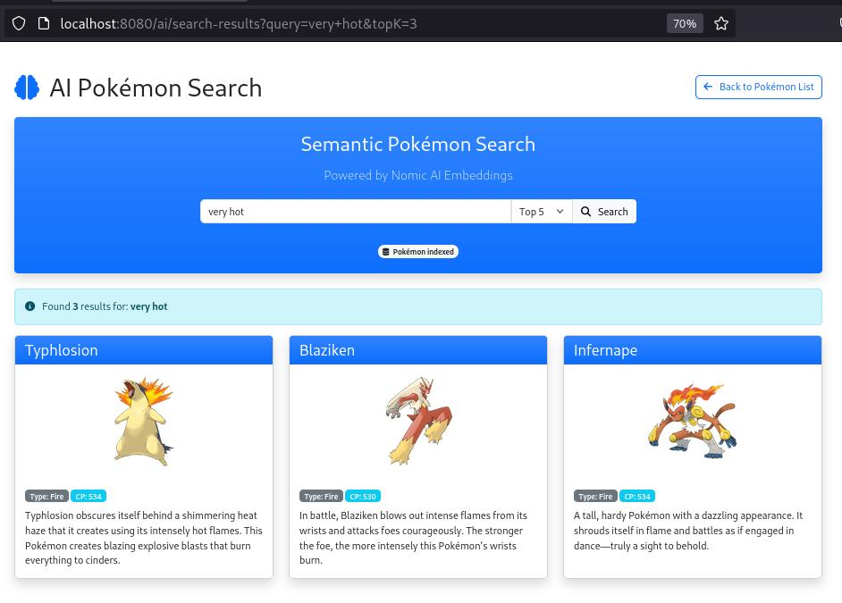

#  Pokemon Repo with AI (Semantic) Search
### This Java Web App:
- ### stores Pokemon information

This table uses the table layout provided by Bootstrap. We can sort the entities according to any column value as well as search for any particular Pokemon using the search bar at the top right corner.

- ### can add / edit pokemon entries

Here we can input / edit the values of any Pokemon we want to add to the database.

- ### has a soft delete function

The soft delete changes the status of a pokemon entity which restricts it from appearing in any of the frontend elements, although it still persists in the database.

  
- ### offers a popup view functionality

- ### performs Semantic Search
  Using NomicAI's Ollama text embedding, we can search for a keyword, and the Pokemon having a description which closely resembles the keyword will be displayed in the order of semantic relation.

Here, we give the keyword "very hot". This outputs pokemons that have descriptions relating to heat and fire.

## Technologies Used
* **Backend:** Java, Spring Boot
* **Database:** PostgreSQL (with PgVector extension for embeddings)
* **AI/Embedding Service:** Ollama (NomicAI's `nomic-embed-text` model)
* **Frontend:** HTML, CSS, JavaScript, Bootstrap
* **Build Tool:** Maven
